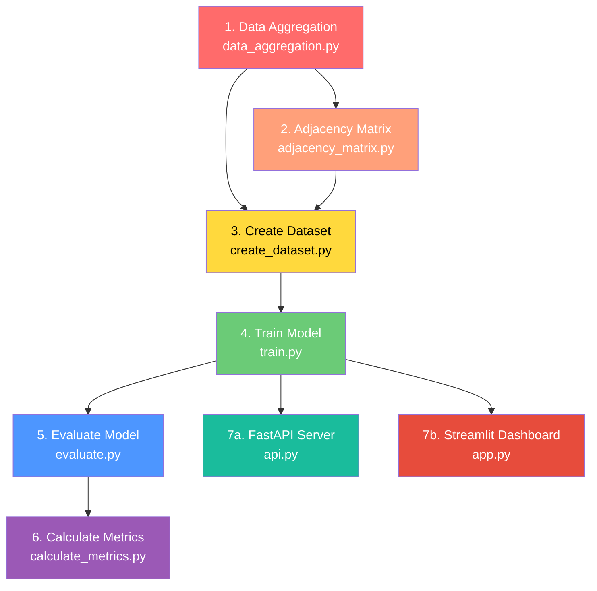

# 🚕 NYC Taxi Demand Forecasting — Project Workflow & Error Report

## Project Overview

A **Spatio-Temporal Graph Neural Network (ST-GNN)** that predicts hourly NYC taxi demand per zone. It uses graph-based spatial modeling (taxi zone adjacency) combined with temporal sliding windows, deployed via **FastAPI** and **Streamlit**.

---

## 🔴 Issues Found

### Critical Issues

| # | File | Issue | Impact |
|---|------|-------|--------|
| 1 | [requirements.txt](file:///d:/spatial_temporal_mobility/requirements.txt) | **Missing dependencies**: `fastapi`, `uvicorn`, `duckdb`, `torch-geometric` are used but not listed | Project won't install correctly from requirements |
| 2 | [api.py](file:///d:/spatial_temporal_mobility/src/api.py) | Uses `from src.model import TrafficGNN` (package-style import) | Will fail when running with `python src/api.py` directly |
| 3 | [data_aggregation.py](file:///d:/spatial_temporal_mobility/src/data_aggregation.py) | Backslash replacement: `replace("\\\\","/")` escapes to `replace("\\", "/")` — only replaces double `\\`, not Windows single `\` path separators | SQL path will fail on Windows if path uses single backslashes |

### Minor Issues

| # | File | Issue |
|---|------|-------|
| 4 | [.gitignore](file:///d:/spatial_temporal_mobility/.gitignore) | Missing `myVenv/` — the virtual env folder `myVenv` is not ignored, only `venv/` is |
| 5 | [.gitignore](file:///d:/spatial_temporal_mobility/.gitignore) | Last line `gitignore` is a stray entry — likely a typo |
| 6 | [.gitignore](file:///d:/spatial_temporal_mobility/.gitignore) | Missing ignore patterns for `__pycache__/`, `*.pyc`, `data/processed/` |
| 7 | [train.py](file:///d:/spatial_temporal_mobility/src/train.py) | Trains **sample-by-sample** (batch size 1) — very slow and noisy gradients |
| 8 | [evaluate.py](file:///d:/spatial_temporal_mobility/src/evaluate.py) | Evaluates on **only 1 sample** at the 80% index — not a robust test-set evaluation |
| 9 | [app.py](file:///d:/spatial_temporal_mobility/src/app.py) | `zone_index_to_name` mapping assumes zone IDs in dataset match sorted `LocationID` list — could mismatch if some zones were filtered during aggregation |
| 10 | [README.md](file:///d:/spatial_temporal_mobility/README.md) | Project structure is incomplete — doesn't list utility files like `data_aggregation.py`, `adjacency_matrix.py`, `create_dataset.py`, `calculate_metrics.py` |

---

## ✅ What's Working Correctly

- **Model architecture** (`model.py`) — clean GATConv + GRU design, shape handling is correct
- **Dataset creation** (`create_dataset.py`) — sliding window, normalization, and feature engineering are solid
- **Adjacency matrix** (`adjacency_matrix.py`) — correct use of GeoPandas `.touches()` for spatial adjacency
- **Metrics calculation** (`calculate_metrics.py`) — standard sklearn metrics, no issues
- **Streamlit dashboard** (`app.py`) — well-structured with caching, good visualization
- **All data files present** — raw data, processed data, model weights, and predictions all exist

---

## 🗺 Complete Project Workflow

### Pipeline Flow



---

### Step-by-Step Execution

#### Step 1 — Data Aggregation
```
cd d:\spatial_temporal_mobility
python src/data_aggregation.py
```
- **Input**: `data/raw/yellow_tripdata_2025-01.parquet`
- **Output**: `data/processed/hourly_demand.csv`
- Uses DuckDB to aggregate taxi trip records into hourly pickup counts per zone

---

#### Step 2 — Build Adjacency Matrix
```
python src/adjacency_matrix.py
```
- **Input**: `data/raw/taxi_zones.shp` (shapefile)
- **Output**: `data/processed/adjacency_matrix.csv`
- Identifies which taxi zones are spatially adjacent using geometric boundary analysis

---

#### Step 3 — Create Final Dataset
```
python src/create_dataset.py
```
- **Input**: `hourly_demand.csv` + `adjacency_matrix.csv`
- **Output**: `data/processed/final_dataset.npz`
- Builds sliding window sequences (window=6 hours)
- Normalizes demand, adds hour-of-day and day-of-week features
- Final tensor shape: `[samples, 6, num_zones, 3]`

---

#### Step 4 — Train the GNN Model
```
python src/train.py
```
- **Input**: `final_dataset.npz`
- **Output**: `data/processed/model_weights.pth`
- Architecture: **GATConv → GATConv → GRU → Linear**
- 40 epochs, Huber loss, Adam optimizer (lr=0.0005)

---

#### Step 5 — Evaluate the Model
```
python src/evaluate.py
```
- **Input**: `final_dataset.npz` + `model_weights.pth`
- **Output**: `y_pred.npy`, `y_true.npy`, `evaluation_plot.png`
- Runs inference on sample at 80% index, saves predictions and plot

---

#### Step 6 — Calculate Metrics
```
python src/calculate_metrics.py
```
- **Input**: `y_pred.npy`, `y_true.npy`
- **Output**: Console output with MSE, RMSE, MAE, R²
- Uses scikit-learn for standard regression metrics

---

#### Step 7a — Launch FastAPI Server
```
uvicorn src.api:app --reload
```
- Exposes `GET /predict` endpoint
- Returns JSON with per-zone demand predictions
- Uses latest temporal window from dataset

---

#### Step 7b — Launch Streamlit Dashboard
```
cd src
streamlit run app.py
```
- Interactive hour slider for time selection
- Shows zone-level demand table and top-15 bar chart
- Uses zone names from `taxi_zone_lookup.csv`

---

## 📁 Complete File Map

```
spatial_temporal_mobility/
├── data/
│   ├── raw/
│   │   ├── yellow_tripdata_2025-01.parquet   # NYC taxi trip data
│   │   ├── taxi_zones.shp (+.dbf,.prj,.shx)  # Zone shapefile
│   │   └── taxi_zone_lookup.csv               # Zone ID → Name mapping
│   └── processed/
│       ├── hourly_demand.csv                  # Step 1 output
│       ├── adjacency_matrix.csv               # Step 2 output
│       ├── final_dataset.npz                  # Step 3 output
│       ├── model_weights.pth                  # Step 4 output
│       ├── y_pred.npy                         # Step 5 output
│       ├── y_true.npy                         # Step 5 output
│       └── evaluation_plot.png                # Step 5 output
├── src/
│   ├── data_aggregation.py    # Step 1: Parquet → hourly CSV
│   ├── adjacency_matrix.py    # Step 2: Shapefile → graph edges
│   ├── create_dataset.py      # Step 3: CSV → tensor dataset
│   ├── model.py               # GNN model definition
│   ├── train.py               # Step 4: Training loop
│   ├── evaluate.py            # Step 5: Inference + plotting
│   ├── calculate_metrics.py   # Step 6: Regression metrics
│   ├── api.py                 # Step 7a: FastAPI server
│   ├── app.py                 # Step 7b: Streamlit dashboard
│   └── __init__.py            # Package marker
├── requirements.txt
├── README.md
└── .gitignore
```
